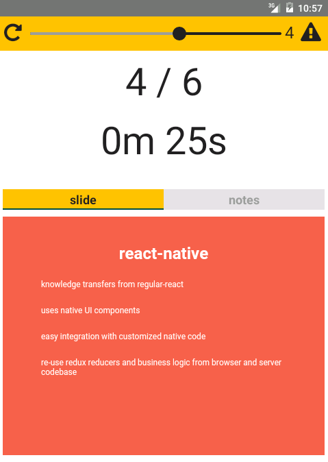

# react-present remote

Mobile remote control for [react-present](../README.md).

Switch slides, view slide previews and notes from your mobile device.

 * [Download the Android version from Google Play](https://play.google.com/store/apps/details?id=com.github.limscoder.ReactPresent)

## Screenshot

## See the remote in action

## Pairing mobile device

The presentation browser and the remote device must both be connected to the internet for pairing.
Press the space bar in the presentation browser to get a numeric pairing code.
Enter the pairing code on the start page of the remote app and tap the screen.

## How it works

A [react-native](https://facebook.github.io/react-native/) app on the mobile device uses [PubNub](https://www.pubnub.com/) to communicate with the presentation running in a browser.

## Development

 * Follow native setup instructions
  * [android setup instructions](https://facebook.github.io/react-native/docs/android-setup.html)
  * OR
  * [iOS setup instructions](https://facebook.github.io/react-native/docs/getting-started.html#content)
 * `cd` to `/remote`
 * Install dependencies

    > npm i

 * Start emulator or connect device

    > emulator -avd ...

    OR

    > open /Applications/Xcode.app/Contents/Developer/Applications/Simulator.app

 * Run app in emulator or connected device

    > react-native run-android
